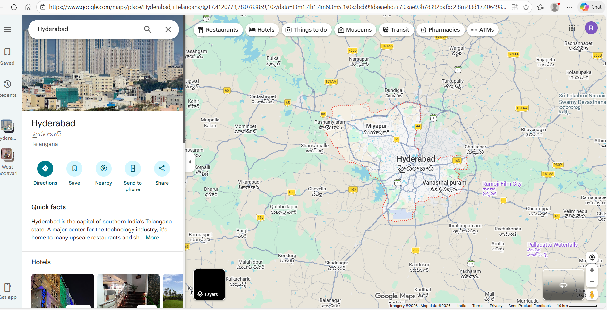
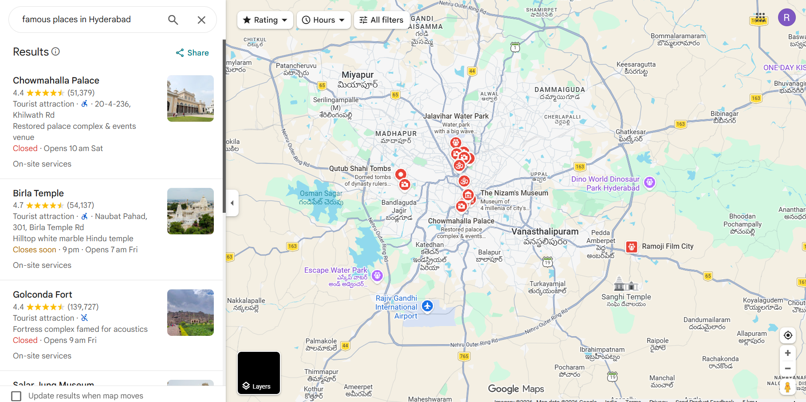
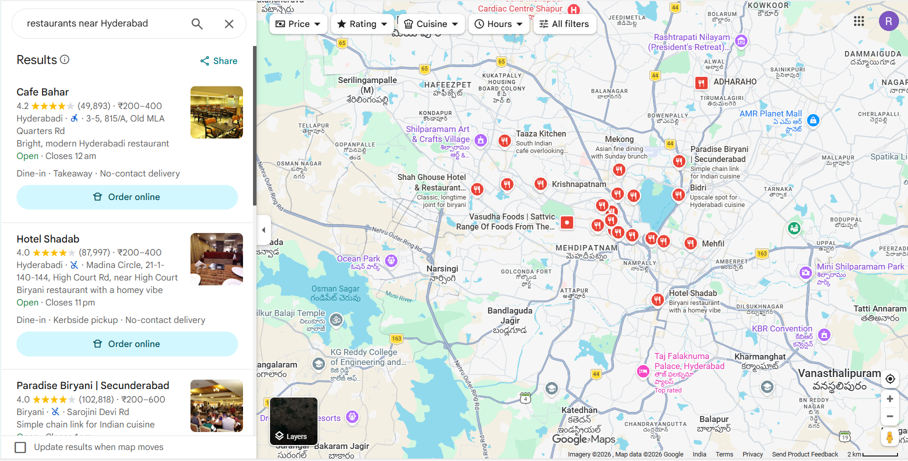
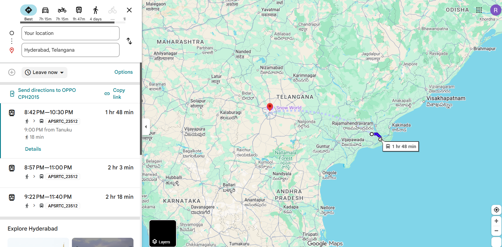
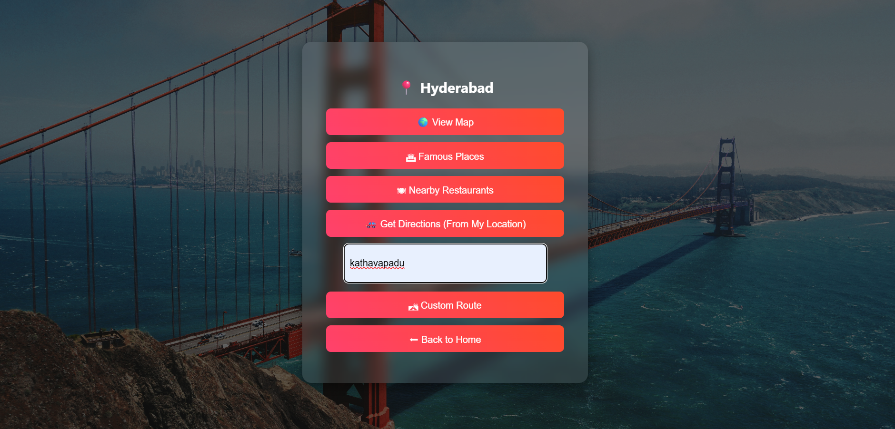
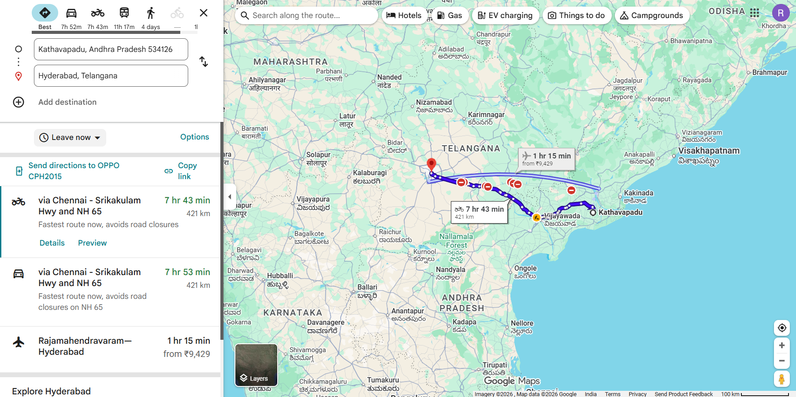

# 🌍 Virtual Tour Guide Web Application

## 📌 About
Virtual Tour Guide is a location-based web application developed using Python, HTML, and CSS.  
The application allows users to search any city and explore it using Google Maps integration.

---

## ✨ Features
- Search any location
- View map in browser
- Explore famous places
- Find nearby restaurants
- Get directions using Google Maps
- Simple and clean user interface

---

## 🛠️ Technologies Used
- Python
- Flask
- HTML
- CSS
- Google Maps Integration
- Git & GitHub

## 📂 Project Structure

Virtual-Tour-Guide/
│
├── app.py
├── templates/
│   ├── index.html
│   └── explore.html
├── static/
│   └── style.css
├── requirements.txt
└── README.md

### 1️⃣ Clone the Repository
git clone https://github.com/rinita11/Virtual-Tour-Guide.git

### 2️⃣ Navigate to Project Folder
cd Virtual-Tour-Guide

### 3️⃣ Install Required Packages
pip install -r requirements.txt

### 4️⃣ Run the Application
python app.py

### 5️⃣ Open in Browser
http://127.0.0.1:5000

## 📷 Output

### Home Page

### Location Search

### Map View

### Explore Page

### Nearby Places

### Directions

### Final View

## 👩‍💻 Author
Rinita Javvadi.

